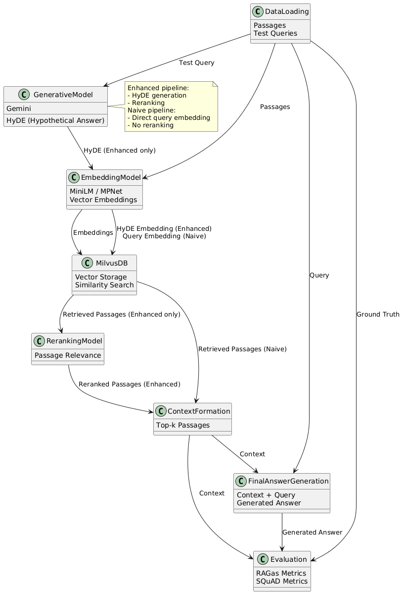

# RAG Evaluation Pipeline

## Executive Summary
This project implements and evaluates a Retrieval-Augmented Generation (RAG) pipeline using a combination of embedding models, a vector database (Milvus), a generative model (Gemini), and evaluation metrics from RAGas and SQuAD. The pipeline is designed to enhance the retrieval of relevant passages for answering queries by generating hypothetical answers (HyDE) and reranking retrieved passages.

The enhanced pipeline improves retrieval quality and stability versus the naive baseline. Embedding choice is pivotal as mpnet outperforms MiniLM. These gains are driven by better evidence concentration from reranking and richer retrieval neighborhoods from HyDE query expansion, yielding higher context quality and slightly lower variance. Optimal retrieval depth is k equals 5, beyond which returns diminish and context dilution appears.

The system is modular but not production ready requiring a full Milvus deployment rather than Milvus lite. For production systems use clustering and GPU or multiprocessing for throughput, cache retrieval, while keeping top k near 5, and centralize observability.

## System Architecture

The RAG (Retrieval-Augmented Generation) evaluation pipeline consists of 

**1. Data Loading:**  
Passages and test queries are ingested into the system, forming the basis for retrieval and evaluation.

**2. Embedding Model:**  
Passages are converted into vector embeddings using a pre-trained embedding model (e.g., MiniLM or MPNet). These embeddings capture semantic information for efficient similarity search.

**3. Milvus Vector Database:**  
Embeddings are stored in Milvus, a vector database, enabling fast retrieval of relevant passages based on query similarity.

**4. Generative Model (Gemini):**  
For each test query, a generative model (Gemini) produces a hypothetical answer (HyDE). This step helps in formulating a more targeted search query for retrieval.

**5. Query Embedding & Retrieval:**  
The hypothetical answer is embedded and used to search the Milvus database, retrieving top-k relevant passages.

**6. Reranking Model:**  
A reranking model reorders the retrieved passages to maximize relevance, ensuring the most pertinent information is prioritized.

**7. Context Formation:**  
The top reranked passages are selected to form the context for answer generation.

**8. Final Answer Generation:**  
The context and original query are fed into the generative model to produce the final answer.

**9. Evaluation:**  
Generated answers, retrieved contexts, and ground truth answers are evaluated using RAGas and SQuAD metrics, measuring aspects like F1 score, exact match, faithfulness, answer relevancy, context recall/precision, and factual correctness.

---

### Note:
In the naive pipeline, the original query is directly embedded and used for retrieval. The retrieved passages are provided as context to the generative model for answer generation. There is no hypothetical answer generation or reranking; retrieval is based solely on the query embedding.

Both pipelines are evaluated using the same metrics, allowing for direct comparison of their effectiveness. The modular architecture supports experimentation with different models, retrieval strategies, and evaluation criteria.



## Experimental Results
This analysis summarizes 11 runs evaluating a Retrieval Augmented Generation pipeline with constant LLM (gemini-2.5-flash-lite) and varying embeddings, retrieval depth, and pipeline mode.

### Prompt strategy

Non-instruction prompts performed poorly: CoT with all-MiniLM-L6-v3 achieved F1 0.785 and Persona with all-MiniLM-L6-v4 achieved F1 3.972, with EM 0 and missing secondary metrics. These were excluded as they rank based on context and are RAG evaluation methods.

### Naive vs enhanced pipeline
Using the three MiniLM instruction runs at k ∈ {3, 5, 10}, the enhanced pipeline (HyDE + reranking) improves F1 from 22.41 (sd 0.41) to 23.02 (sd 0.21), a +0.62 absolute gain (~2.8%), while reducing variance. It also increases context quality: recall from 0.618 to 0.649 (+5.0%), precision from 0.807 to 0.859 (+6.4%), and faithfulness from 0.919 to 0.931 (+1.3%). However, EM drops from 1.642 to 1.340 (~-18.4%) and answer relevancy declines from 0.848 to 0.817 (~-3.7 %). Factual correctness rises slightly from 0.157 to 0.160 (+2.3%). These results suggest enhanced retrieval sharpens and cleans context (higher precision/recall, faithfulness), but the generation step becomes more conservative, hurting EM and perceived relevancy.

### Embedding comparison. 
The all-mpnet-base-v2 outperforms all-MiniLM-L6-v3. For three naive MiniLM runs, mean F1 is 22.41 (sd 0.41). For three naive mpnet runs, mean F1 is 24.19 (sd 0.33), a +1.78 absolute gain (~7.9%). mpnet also improves EM (2.237 vs 1.642), faithfulness (0.935 vs 0.919), answer relevancy (0.876 vs 0.848), recall (0.683 vs 0.618), precision (0.822 vs 0.807), and factual correctness (0.177 vs 0.157). The best overall run is all-mpnet-base-v3 at k=5 with F1 24.522, EM 2.320, faithfulness 0.941, answer relevancy 0.879, recall 0.681, precision 0.829, and factual correctness 0.180.

### Effect of retrieval depth k. 
Across both embeddings, performance peaks at k=5. For MiniLM (naive), F1 rises from 21.945 (k=3) to 22.741 (k=5, +3.6%), then dips to 22.532 (k=10, -0.9% vs k=5). For mpnet (naive), F1 increases from 23.854 (k=3) to 24.522 (k=5, +2.8%), then slightly declines to 24.189 (k=10, -1.4% vs k=5). EM shows the same peak at k=5. 
This indicates diminishing returns and potential context dilution beyond k=5.

## Enhancement Analysis

The enhanced pipeline combines HyDE-style hypothetical answer generation with a reranking stage, to improve retrieval quality and downstream answer robustness. 

On the MiniLM instruction runs, the enhanced variant improves mean F1 from 22.41 to 23.02 and raises context recall from 0.618 to 0.649 and precision from 0.807 to 0.859, alongside higher faithfulness (0.919 → 0.931) as computed from results/experiment.csv. 

HyDE reframes the query into a semantically richer pseudo-answer, which expands the neighborhood of relevant evidence during retrieval. This is because generative query expansion sharpens dense retrieval without relevance labels [1]. The reranker concentrates top slots on the most pertinent passages. A well-documented effect of cross-encoder reranking is that it trades breadth for precision in the top-k [2][3]. The slight drop in EM (1.642 → 1.340) and answer relevancy (0.848 → 0.817) is consistent with a precision shift: stricter, semantically aligned contexts can reduce lexical overlap with ground truths, which hurts exact match and perceived topical breadth even as factual grounding improves. 

Beyond pipeline steps, embedding choice remains a dominant factor. Switching from all-MiniLM to all-mpnet improved F1 from 22.41 to 24.19 on naive runs, with the best configuration (all-mpnet-base-v3, k=5) reaching F1 24.522 while maintaining strong faithfulness (0.941), aligned with MPNet’s stronger contextual token permutation pretraining [4].

Despite the overhead, the enhanced pipeline’s consistency gains (higher context recall/precision and faithfulness) were detectable across runs, indicating the evaluation signal was stable enough to attribute improvements to HyDE and reranking rather than noise.

### Implementation challenges.

RAGAS evaluation was the primary bottleneck: each full run took approximately ~1.5 hours on the dataset when executed with gpt-4o-mini. This latency arises because RAGAS computes faithfulness, answer relevancy, and related dimensions via LLM-based judgments per sample, often with multi turn prompts and citation checks, causing runtime to scale with dataset size, context length, and output length [5]. Using gpt-4o-mini mitigates cost but still imposes nontrivial end-to-end latency due to per-request overheads, rate limits, and prompt tokenization, especially when answers and contexts are long.

### Production Considerations
For production systems, using the Milvus lite version is not advisable due to its limitations in scalability and performance. Instead, deploying a full-featured Milvus instance is recommended to handle larger datasets and provide robust vector search capabilities. The additional constraint that came as a result of using Milvus lite was the inability to use any other search methodology other than IVF, this means that I could not experiment with other search algorithms such as HNSW that might have yielded better results. 

For the production environment, we can batch and precompute embeddings; enable GPU or multi-process workers for throughput. Keeping retrieval top-k near 5 (per results) would avoid context dilution.

Additionally, caching RAGAS evaluations for repeated queries or contexts could amortize the high cost of LLM-based metrics in production settings. For the production environment we can also centralize observability with structured logs, metrics (P95 latency, cache hit rate, recall), tracing across components, and prompt/version tracking.

## References
[1] Gao et al., Precise Zero-shot Dense Retrieval without Relevance Labels (HyDE), arXiv:2212.10496.

[2] Reimers & Gurevych, Sentence-BERT: Siamese BERT-Networks for Sentence Embeddings, EMNLP 2019; Cross-Encoder reranking docs at sbert.net.

[3] Nogueira & Cho, Passage Re-ranking with BERT, arXiv:1901.04085.

[4] Song et al., MPNet: Masked and Permuted Pre-training for Language Understanding, arXiv:2004.09297.

[5] RAGAS documentation, https://ragas.readthedocs.io/

## Setup Instructions
1. Clone the repository:
   ```bash
   git clone https://github.com/RishabhDev42/Application-of-LLM-Assignment-2.git
   ```
2. Navigate to the project directory:
   ```bash
    cd Application-of-LLM-Assignment-2
    ```
3. Install the required dependencies:
    ```bash
    pip install -r requirements.txt
    ```
4. Run both the naive and enhanced pipelines from their ipython notebooks:
    ```bash
   cd src
   jupyter notebook
   ```
5. Open the notebook in your browser. Select enhanced_rag.ipynb or naive_rag.ipynb and run the cells.

## AI Appendix
/appendix/AI_appendix.md

