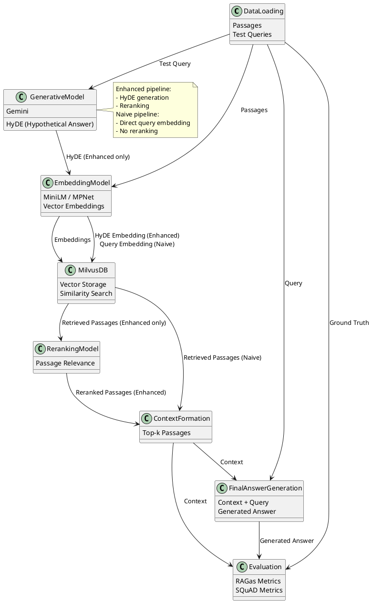

```puml
@startuml
!define RECTANGLE class

RECTANGLE DataLoading {
  Passages
  Test Queries
}

RECTANGLE EmbeddingModel {
  MiniLM / MPNet
  Vector Embeddings
}

RECTANGLE MilvusDB {
  Vector Storage
  Similarity Search
}

RECTANGLE GenerativeModel {
  Gemini
  HyDE (Hypothetical Answer)
}

RECTANGLE RerankingModel {
  Passage Relevance
}

RECTANGLE ContextFormation {
  Top-k Passages
}

RECTANGLE FinalAnswerGeneration {
  Context + Query
  Generated Answer
}

RECTANGLE Evaluation {
  RAGas Metrics
  SQuAD Metrics
}

DataLoading --> EmbeddingModel : Passages
EmbeddingModel --> MilvusDB : Embeddings
DataLoading --> GenerativeModel : Test Query
GenerativeModel --> EmbeddingModel : HyDE (Enhanced only)
EmbeddingModel --> MilvusDB : HyDE Embedding (Enhanced)\nQuery Embedding (Naive)
MilvusDB --> RerankingModel : Retrieved Passages (Enhanced only)
MilvusDB --> ContextFormation : Retrieved Passages (Naive)
RerankingModel --> ContextFormation : Reranked Passages (Enhanced)
ContextFormation --> FinalAnswerGeneration : Context
DataLoading --> FinalAnswerGeneration : Query
FinalAnswerGeneration --> Evaluation : Generated Answer
ContextFormation --> Evaluation : Context
DataLoading --> Evaluation : Ground Truth

note right of GenerativeModel
Enhanced pipeline:
- HyDE generation
- Reranking
Naive pipeline:
- Direct query embedding
- No reranking
end note

@enduml
```